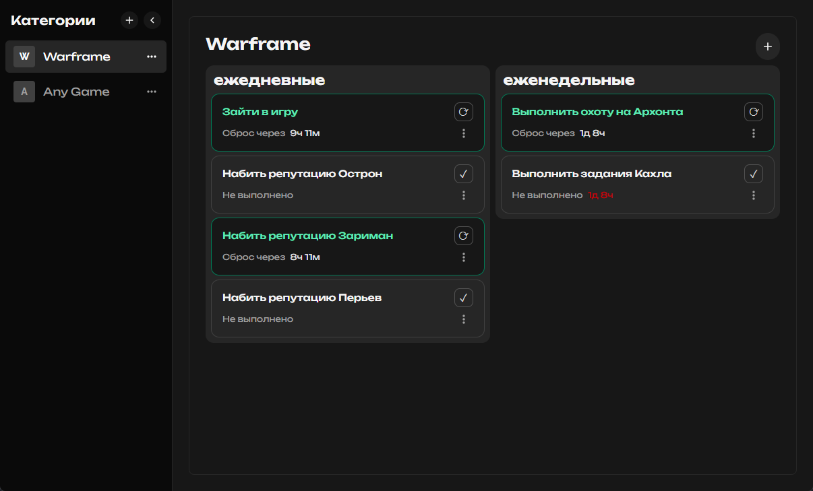

# Everydo (Wails VueJS App)

Это десктопный проект, созданный с использованием [Wails](https://wails.io) — фреймворка для построения приложений на Go и Vue.js.

## Технологии

- **Бэкенд**: Go
- **Фронтенд**: Vue 3 + JavaScript
- **Сборка и запуск**: Wails + Vite

## Быстрый старт

1. Убедитесь, что установлены Go, Node.js и Wails.
2. Клонируйте репозиторий:
   ```bash
   git clone https://github.com/orriginalo/Everydo.git
   cd Everydo
   ```
3. Убедитесь что wails готов к работе:
   ```bash
   wails doctor
   ```
4. Для сборки приложения выполните:
   ```bash
   wails build
   ```
   
